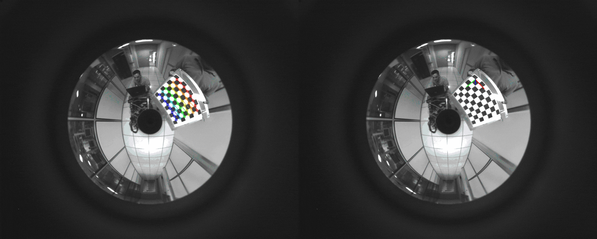
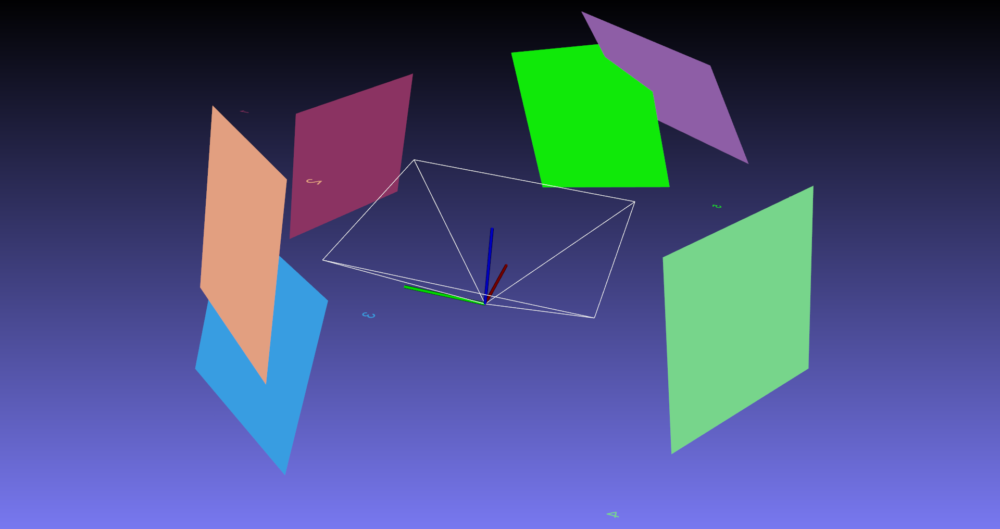

# 📝 small notes and samples related to omnidirectional cameras #
***

- central cameras: camera systems in which optical rays coming from the camera and reflected by the mirror surface intersect into a unique point.
- central omnidirectional cameras:
  + catadioptric omnidirectional cameras: combining a pinhole camera (perspective camera) with hyperbolic, parabolic, and elliptical mirrors
  + dioptric omnidirectional cameras: using fisheye lens to enlarge the FOV.

**The samples in this repo use OpenCV's implementation of CMei's model (ref 1.) to calibrate a catadioptric camera system.**

<p align="center">
  
</p>

<p align="center">
  
</p>

## :tada: TODO ##
***

- [x] Add samples for omnidirectional camera calibration and rectification
- [x] Test on real data

## 🎛  Dependencies ##
***

```bash
sudo apt-get install \
    libopencv-dev \
    rapidjson-dev \
```

## 🔨 How to Build ##
***

```bash
make apps
```

## :running: How to Run ##
***

```bash
// calibration sample
./build/omnidirectional_camera_calibration ./data/param_config.json

// undistortion sample
./build/omnidirectional_camera_undistortion ./data/img_para_001.pgm

```

**the calibration data for this test is from [HERE](http://www-sop.inria.fr/icare/personnel/Christopher.Mei/ChristopherMeiPhDStudentToolbox.html)**

## :gem: References ##
***

1. [Single View Point Omnidirectional Camera Calibration from Planar Grids, ICRA 2007](https://www.robots.ox.ac.uk/~cmei/articles/single_viewpoint_calib_mei_07.pdf)

2. [A Multiple-Camera System Calibration Toolbox Using A Feature Descriptor-Based Calibration Pattern, IROS 2013](https://people.inf.ethz.ch/pomarc/pubs/LiIROS13a.pdf)

3. [Omnidirectional Camera by Scaramuzza et al.](http://rpg.ifi.uzh.ch/docs/omnidirectional_camera.pdf)
